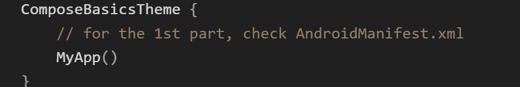
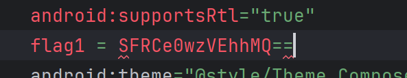
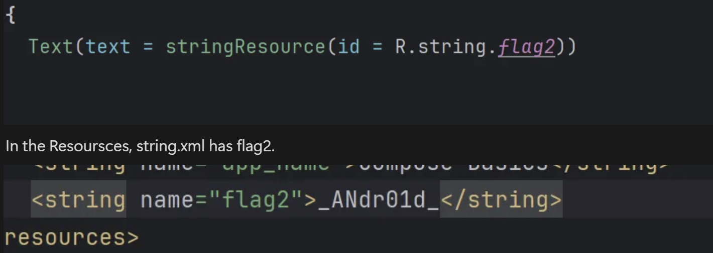
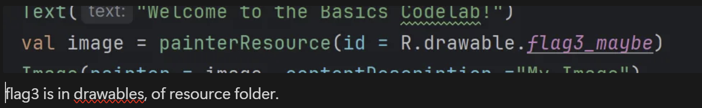

## Description
You've intercepted a suspicious Android Studio project. Intelligence suggests that a highly classified flag is hidden within the project. Your mission is to uncover the flag, which is believed to be strategically placed in three different locations within the project.

Files - https://drive.google.com/file/d/1RADU_cNgiXfp_VgROnBnvcTzOfjkQZx6/view?usp=sharing

## Writeup
The Code in Main.kt in src folder will lead us to the flag.

This is our first hint.

This is a simple base64 encryption, after decrypting this, u get flag1 → HTB{L3THa1

flag2 → _ANdr01d_

This image is given, the name says flag3_maybe. the flag is hidden with stegnography using steghide command, the file can be extracted.`steghide extract -sf flag3_maybe.png` u will get the flag.

flag3 → ki113R}

## Flag
HTB{L3THa1_ANdr01d_ki113R}

## Author
Vitthal Choudhary
