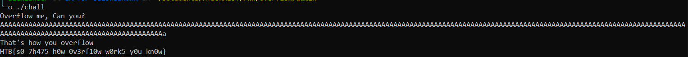

## Description

Do you know how to overflow?

## Writeup

We were given 2 files, One is chall.c which is the source code and another one is chall, which is the binary executable, there is also a connection to remote host where we should send out exploit to get the flag

Looking at chall.c

```C
#include <stdio.h>

int main(){
    char buf[150];

    puts("Overflow me, Can you?");

    int len = read(0, buf, 0x100);

    if(len > 150){
        puts("That's how you overflow");
        system("cat flag.txt");
    }else{
        puts("Nah, that's not how you do it");
    }

    exit(1337);
}
```

Reading the provided C code, we can see that len of buf is `150`, But... we are reading in `0x100` leading to a Buffer Overflow, this is a very staic Buffer Overflow challenge, We can see that the binary is printing the flag if the length of out message is more 150.
So, We just send more than 150 bytes of data and get the flag :)



## Flag

**HTB{s0_7h475_h0w_0v3rf10w_w0rk5_y0u_kn0w}**

## Author

Sai Shashank
