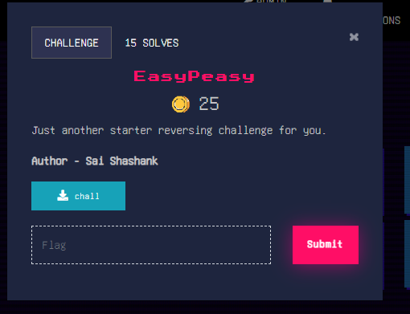
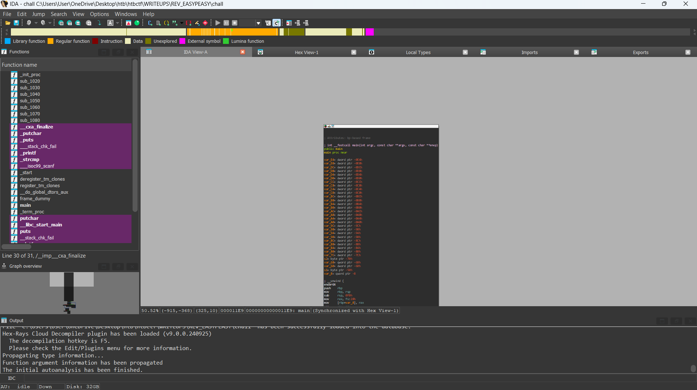
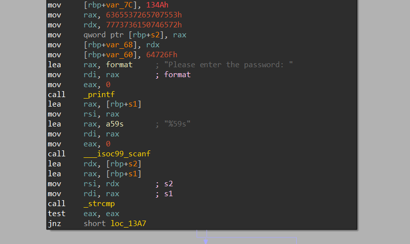
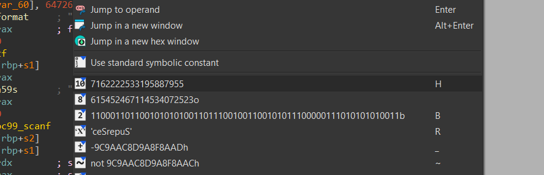
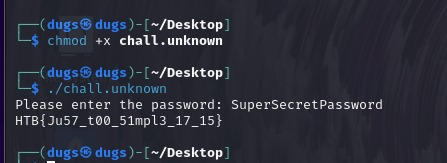

## Description
Just another starter reversing challenge for you.

## Writeup
step:- 1 open the given binary in ida.

step:- 2 analyse the main function

step:- 3 a number/string is getting compared with the user input string

step:- 4 right click on the string and convert it into ascii

step:- 5 after converting all the strings we can see that that the string "SuperSecretPassword" is getting compared with the input string

step:- 6 now run the executable and provide this string as user input and then we got the flag

## Flag

HTB{Ju57_t00_51mpl3_17_15}

## Author
Sai Shashank

