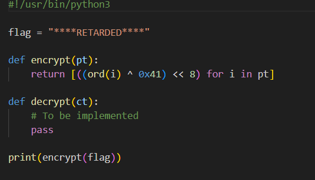
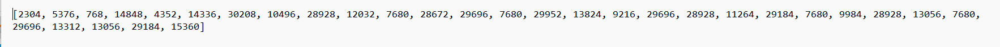
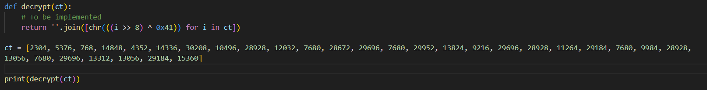
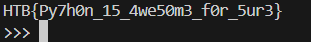

## Description

I like Python, So.... here's a Python starter for you.

## Writeup

We were given two files; the first is the Python program used to convert the flag into the encrypted text, and the output of that Python file is in out.txt.

Step 1: After analyzing the encrypt function, it can be broken down into three steps.

--> First, it converts each character of the flag into ASCII.

--> Then, it applies a bitwise XOR operation between the ASCII value and 0x41.

--> The result of the XOR operation is then shifted left by 8 bits.

--> The function returns a list of the transformed values for each character.

Step 2: After analyzing it, write the decryption code and provide out.txt content as input.

--> right shift by 8 bits

--> XOR with 0x41

--> ord to chr

--> concatenates them into a single string

Step 3: Run the Python code, and you will get the flag.

## Flag

**HTB{Py7h0n_15_4we50m3_f0r_5ur3}**

## Author
Sai Shashank
