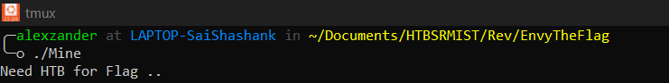
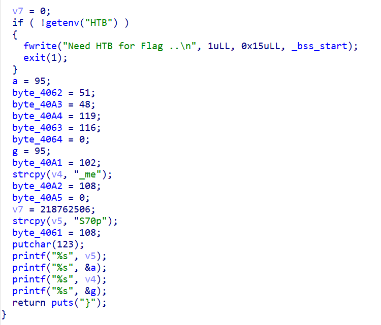
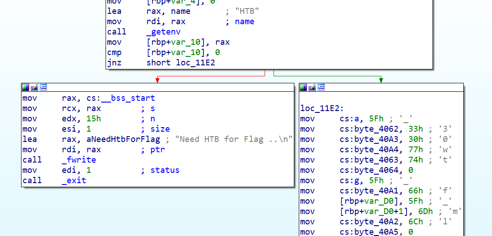
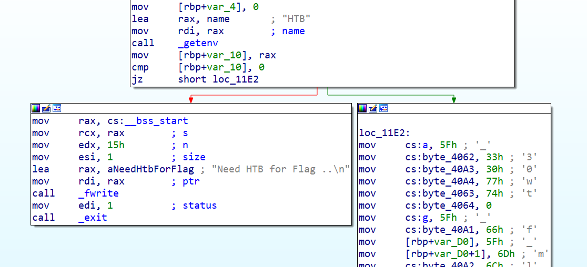
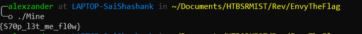

## Description

The author is too tardy to think of a question. However, there are situations when little changes make an enormous impact. And I really don't care about those changes.

## Writeup

We were give one and only Binary file called "Mine" to download.

Running the file, we see it prints "Need HTB for Flag .."

Nothing much of use there, Firing up IDA and looking at Main function, we see there is a check "checking for a env_variable called HTB", It prints the flag if it is able to find it.

## Path

Well, There are two ways to go about it, we can create a env_variable and pass the binary check or we can just patch the binary to print flag. 

Looking at the assembly, we see an "JNZ" (Jump Not Zero) Instruction after the comparision.

We just patch it to "JZ" (Jump Zero), So it prints the flag whenever the check is not satisfied.

Saving and running the binary, Just prints the Flag.

## Flag

**HTB{S70p_l3t_me_fl0w}**

## Author
Nikhil Patil
