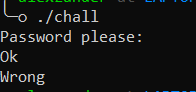
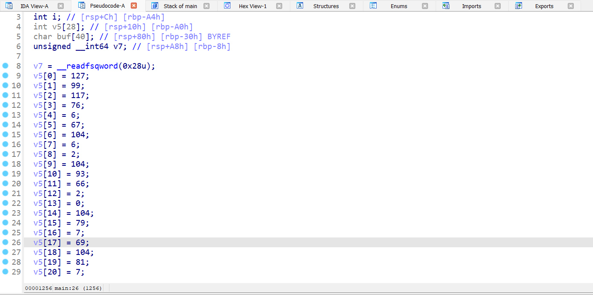
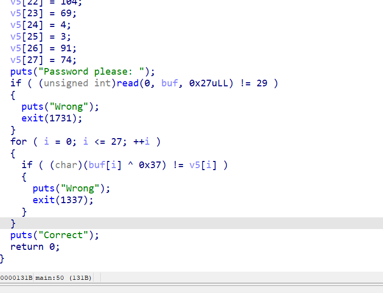
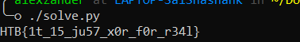

## Description

I made a simple password checker, Btw.... I forgot the password :)

## Writeup

Reading the description, it seems like the guy want's us to extract the password from a password checker.

We were provided with only 1 file, which on running asks us for the password, trying something, it just says ``Wrong`` and exits, such a mean binary.



To start some static analysis, we fire up IDA and decompile the main() function.



We can see an array being initalized with some random integer values.



Looking at the psudo-code generated by IDA, we can see that, there are 2 check being performed

--> First one checking if the length of the input is 29 ( -1 if newline, which is 28)

--> Second, Our input is being XOR'ed with 0x37 and then compared with the values in the array that was previously initialized.

So, we know:

--> Length of our input should be 28 characters 

--> inp ^ 0x37 = arr (and) arr ^ 0x37 = inp

Knowing how XOR works, we can easily calculated the input required to pass the check, Here's Python script to automate the process.

```python
a = [127, 99, 117, 76, 6, 67, 104, 6, 2, 104, 93, 66, 2, 0, 104, 79, 7, 69, 104, 81, 7, 69, 104, 69, 4, 3, 91, 74]
print(''.join([chr(i ^ 0x37) for i in a]))
```

Running the script will print the flag.



## Flag

**HTB{1t_15_ju57_x0r_f0r_r34l}**

## Author
Sai Shashank